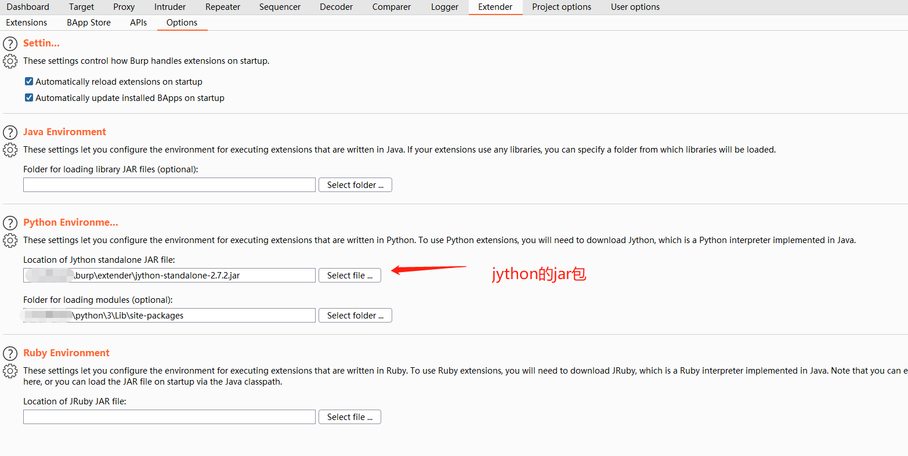
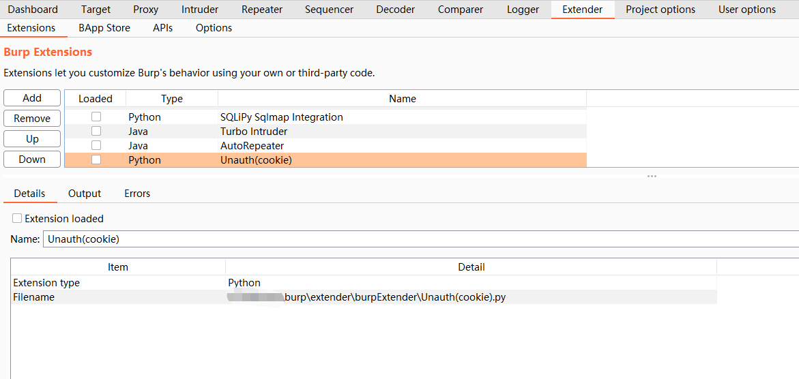

# burpExtender

### 简介

利用python开发的burp插件提高渗透测试效率。

### 环境搭建

BurpSuite 是使用 Java 编程语言编写的，所以想要使用 Python 编程语言开发其插件，就必须借助于 Jython。Jython 本质上是一个 Java 应用程序，它允许 coder 们使用 Java 代码调用 Python 库反之，也可以使用 Python 调用 Java 的库。

Python 编写的插件文件后缀为 py 文件，不能由 Burp 直接加载，所以在加载前需要先设置 Jython 的路径。在 [Jython 官方](https://www.jython.org/download.html)下载页面选择 Jython 独立 jar 包（jython-standalone）。然后再burp里边配置jython和python的模块路径。

环境搭建好后就可以在"Extensions"模块中使用插件了。

### 插件介绍

1. Unauth(cookie)：获取到proxy中的请求，删除header里边的Cookie，对比原始返回和修改请求后的返回，如果一致可能存在未授权，将背景颜色标记为红色。资源为图片、header中不含Cookie的请求，不予处理。

### 参考链接

https://www.cnblogs.com/wjrblogs/p/15705552.html

https://github.com/bit4woo/burp-api-drops

https://wooyun.js.org/drops/BurpSuite%E6%8F%92%E4%BB%B6%E5%BC%80%E5%8F%91%E6%8C%87%E5%8D%97%E4%B9%8B%20Python%20%E7%AF%87.html#

